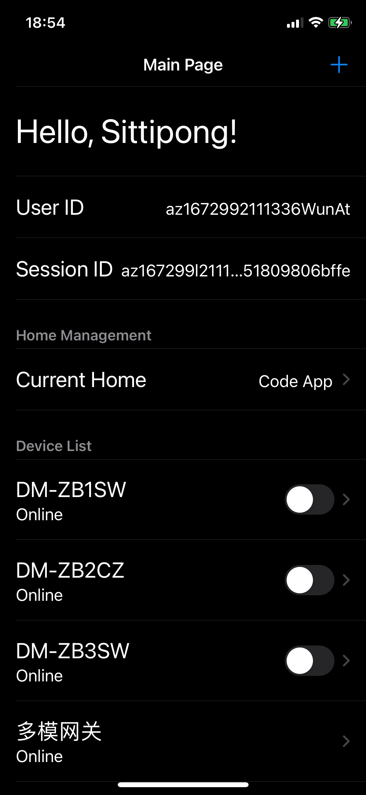

# PoC Smart Life SDK

A proof of concept (PoC) to use tuya app sdk


## Acknowledgements

 - [Tuya Docs](https://developer.tuya.com/en/docs/app-development/feature-overview?id=Ka5cgmlybhjk8)
 - [Tuya iOS SDK Sample Swift (Git Repo)](https://github.com/tuya/tuya-home-ios-sdk-sample-swift)
 


## Requirement

- Xcode 14.0
- Cocoapood 1.11.3

## Installation

1. Clone this repo.
```bash
git clone <this repo url>
cd <this repo folder>
```

2. Install project's dependency with Cocoapood.

```bash
pod install --repo-update
```

3. Copy image secret (to_s.bmp) to project.

```bash
cp <your to_s.bmp file> ./smart-life-sdk/to_s.bmp
```

4. Set `app key` and `secret key` at AppKey.swift

5. Open smart-life-sdk.xcworkspace then Build & Run iOS App.
## Screenshots


